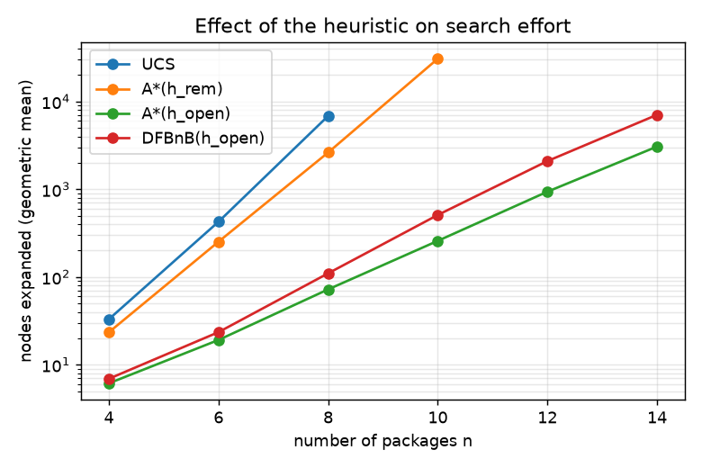
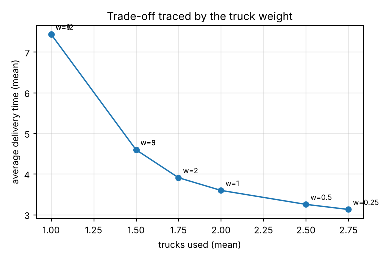

# Assignment 1 — Truck Loading and Delivery Planning (CSE643)

> Revising for the assessment? See [LEARNINGS.md](LEARNINGS.md).

Load arriving packages into trucks to minimise

```
cost = w_truck * (#trucks) + w_delay * (average delivery time)
```

Modelled as state-space search. Compares uninformed search, informed search, beam search,
and local search over complete plans — the algorithm families the course teaches.

```
assignment1/
├── truckload/
│   ├── problem.py      # instance, generator, trip simulator, plan evaluator
│   ├── search.py       # state space + BFS, DFS, UCS, A*, Greedy, Beam
│   └── heuristics.py   # Simulated Annealing, Genetic Algorithm
├── demo.py             # solve one instance, print the plans
├── run_experiments.py  # regenerates results/
├── results/RESULTS.md  # full tables + plots
└── tests/               # optimality, admissibility, simulator tests
```

```bash
python demo.py --n 10 --seed 3            # see the plans
python tests/test_truckload.py            # or: python -m pytest tests
python run_experiments.py [--quick]       # regenerate results/
```

---

## Summary

Numbers from `results/RESULTS.md`, n = 8 (full tables: §4).

| Algorithm | Idea | Optimal | n=8: gap / nodes |
|---|---|---|---|
| BFS | expand level by level | no | 21.2%, 5.8k nodes |
| DFS | first complete plan found | no | 21.2%, 9 nodes |
| UCS | expand cheapest `g` first | yes | 0.0%, 3.6k nodes |
| A\*(`h_rem`) | UCS + driving-time heuristic | yes | 0.0%, 2.0k nodes |
| A\*(`h_open`) | UCS + heuristic incl. open trips | yes | 0.0%, 74 nodes |
| Greedy best-first | lowest `h`, ignores `g` | no | 106.5% |
| Beam (k=5) | keep 5 best partial plans | no | 2.7% |
| Beam (k=25) | keep 25 best | no | 0.0% |
| Simulated annealing | perturb one plan, cool over time | no | 0.0% (1.3% at n=16) |
| Genetic algorithm | evolve a population of plans | no | 0.0% (20% at n=16) |

**Use A\*(`h_open`)** up to ~16–20 packages — optimal, far fewer nodes than UCS. Beyond that,
**simulated annealing** is the steadier fallback; the genetic algorithm matches it at small n
but falls behind at n=16 with a fixed population. **Avoid greedy best-first** — it ignores the
truck cost and buys far too many trucks.

---

## 1. Model

| Item | Choice |
|---|---|
| Geography | One highway, equidistant stops. Stop `k` is `k·τ` from the depot. |
| Arrivals | Known in advance, Poisson at 2 packages per τ. |
| Trucks | Identical, capacity `C` (default 4). Number of trucks is a decision. |
| Loading | Load-on-arrival. Truck is a stack: last loaded is nearest the door. |
| Ordering | **Hard rule.** A package can join a trip only if its destination is at or before the one currently at the door. Otherwise that move doesn't exist. |
| Departure | `max(truck back at depot, last package of the trip arrived)`. |
| Objective | `w_truck = 3`, `w_delay = 1`. |

A truck's trip is a non-increasing run of destinations by construction — extra trucks act as
extra sorting stacks (patience sorting). No rehandling, no extra cost term: the ordering rule
is enforced on which moves exist, not priced afterward.

## 2. State space

* **State** `(i, trucks)` — `i` is the next package to place; each truck is `(free_at, open_trip)`.
* **Start** `(0, ())`.
* **Actions** for package `i`:
  * `APPEND k` — add to truck k's open trip, if not full and destination order holds.
  * `NEW k` — dispatch truck k's open trip, start a new one with `i`.
  * `TRUCK` — bring in a new truck, start its trip with `i`.
  * `FINISH` — once `i = n`, dispatch every remaining open trip. Goal.
* **Cost** — `w_truck` per truck added; `w_delay/n × Σ delays` per trip dispatched.
* Dispatch is decided retroactively, so there's no "wait" action. Trucks are sorted to merge
  symmetric states. Branching factor ≈ `2K+1` for `K` trucks; depth is `n`.

**Heuristics** (admissible lower bounds on remaining cost):

| Name | Value |
|---|---|
| `h0` | 0 (gives UCS) |
| `h_rem` | driving time of unplaced packages |
| `h_open` | `h_rem` + delay of open trips if dispatched now |

Neither bounds the truck term — one truck could in principle serve everything by waiting.

## 3. Algorithms compared

| Family | Algorithms | Optimal |
|---|---|---|
| Uninformed | BFS, DFS, UCS | UCS only |
| Informed | A\*(`h_rem`), A\*(`h_open`), Greedy best-first | A\* only |
| Beam search | k = 5, 25 | no |
| Local search | Simulated annealing, Genetic algorithm | no |

Every plan is scored by the same `evaluate()`. Tests check UCS/A\* against brute force, and
that the genetic algorithm stays within a sane bound of the optimum.

## 4. Experimental findings

4 destinations, capacity 4, node limit 200k, 4 random instances per size.

**Nodes to reach the proven optimum** (geometric mean):

| n | UCS | A\*(h_rem) | A\*(h_open) |
|---|---|---|---|
| 4 | 24 | 18 | 6 |
| 6 | 207 | 97 | 15 |
| 8 | 2,191 | 885 | 55 |



**Quality vs effort** (gap %, nodes):

| algorithm | n=8 | n=12 | n=16 |
|---|---|---|---|
| BFS / DFS | 21.2% | — | — |
| UCS | 0.0%, 3.6k | — | — |
| A\*(h_open) | 0.0%, 74 | 0.0%, 527 | 0.0%, 3.2k |
| Greedy best-first | 106.5% | 125.9% | 115.2% |
| Beam k=25 | 0.0% | 0.0% | 0.9% |
| Simulated annealing | 0.0% | 0.4% | 1.3% |
| Genetic algorithm | 0.0% | 1.9% | 20.0% |

GA keeps pace with SA up to n=12, then falls behind at n=16 — a fixed population/generation
budget doesn't scale as well as SA's single long trajectory.

**Model variations** (n = 8):

| variation | cost | trucks | avg delay |
|---|---|---|---|
| base (A\*, optimal) | 9.42 | 1.75 | 4.17 |
| bigger trucks (cap 6) | 9.33 | 1.75 | 4.08 |
| smaller trucks (cap 2) | 10.70 | 2.00 | 4.70 |
| fixed fleet of 1 | 11.57 | 1.00 | 8.57 |
| busier centre | 9.50 | 1.75 | 4.25 |
| quieter centre | 9.02 | 1.50 | 4.52 |
| skewed destinations | 8.72 | 2.00 | 2.72 |
| GA (pop=40) | 9.42 | 1.75 | 4.17 |
| GA (pop=10) | 9.97 | 2.00 | 3.97 |

**Weight sweep:** raising `w_truck` trades trucks for delay, settling on 1 truck once the
weight is high enough.



## 5. Recommended approach

1. Formulate as sequential placement in arrival order; dispatch decided retroactively; trucks deduplicated.
2. Up to ~16–20 packages: **A\* with `h_open`** — optimal, cheap.
3. Larger instances: **simulated annealing** or the **genetic algorithm**.
4. Online (arrivals unknown): re-plan on a rolling horizon with A\*/SA/GA.

Relies on: arrivals known for the window, identical trucks, one highway, load-on-arrival,
destination order enforced structurally (not priced).

## 6. Learnings

1. State = packages placed + truck status. Retroactive dispatch removes "wait"; sorted trucks remove symmetric states.
2. Ordering is patience sorting — each trip is a non-increasing run of destinations; extra trucks act as extra stacks.
3. Trade-off is trucks vs waiting. Weights decide which wins; ordering itself is a hard rule, not a lever.
4. `h_open` cuts A\*'s nodes by 2–3 orders of magnitude vs UCS.
5. Uninformed search is weak here: all goals sit at depth n, so BFS enumerates almost everything; DFS returns its first plan, often far off.
6. A heuristic blind to the truck term misleads greedy methods: greedy best-first buys trucks it doesn't need. A\* is safe because it keeps `g`.
7. Local search is a strong fallback once A\* gets too big — both land within a few percent of optimum at n≤12.
8. GA needs enough population/generations to keep up as n grows; a fixed budget falls behind SA at larger n.
9. A hard ordering constraint is simpler than a priced one, and matches the assignment: no rehandle parameter, no violation-cost sweep.

## 7. Further variations (not implemented)

* Heterogeneous trucks — add a truck type to the state, one `TRUCK` branch per type.
* Non-equidistant routes — replace `d·τ` with real route length; `h_rem` stays admissible.
* Deadlines or priorities — weighted delay or pruning.
* Staging area — buffer packages on the floor instead of loading immediately.
* Uncertain arrivals — rolling horizon, or MDP/expectimax.
