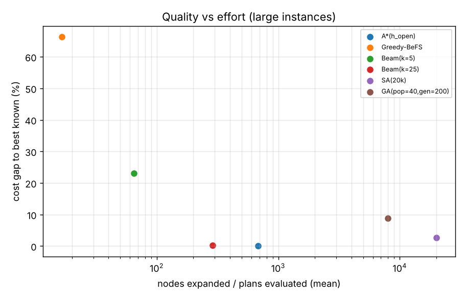

# Experimental results

Generated by `run_experiments.py`. Default parameters: capacity=4, tau=1.0,
w_truck=3.0, w_delay=1.0, 4 destinations,
one package arriving per tick in a random destination sequence,
4 random instances per size, node limit 200,000.

`gap %` = (cost - reference) / reference; `best hit` = how often the algorithm matched the reference.

## 1. All algorithms, small instances

**n = 4** (reference = optimum on 4/4 instances, else best found)

| algorithm | finished | gap % | best hit | nodes expanded* | time s | trucks | avg delay |
|---|---|---|---|---|---|---|---|
| BFS | 4/4 | 2.5 | 3/4 | 15 | 0.000 | 1.00 | 4.25 |
| DFS | 4/4 | 2.5 | 3/4 | 5 | 0.000 | 1.00 | 4.25 |
| UCS | 4/4 | 0.0 | 4/4 | 21 | 0.000 | 1.00 | 4.12 |
| A*(h_rem) | 4/4 | 0.0 | 4/4 | 20 | 0.000 | 1.00 | 4.12 |
| A*(h_open) | 4/4 | 0.0 | 4/4 | 7 | 0.000 | 1.00 | 4.12 |
| Greedy-BeFS | 4/4 | 40.8 | 0/4 | 6 | 0.000 | 2.50 | 2.50 |
| Beam(k=5) | 4/4 | 0.0 | 4/4 | 15 | 0.000 | 1.00 | 4.12 |
| Beam(k=25) | 4/4 | 0.0 | 4/4 | 38 | 0.000 | 1.00 | 4.12 |
| SA(20k) | 4/4 | 0.0 | 4/4 | 20,001 | 0.211 | 1.00 | 4.12 |
| GA(pop=40,gen=200) | 4/4 | 0.0 | 4/4 | 8,000 | 0.089 | 1.00 | 4.12 |

**n = 6** (reference = optimum on 4/4 instances, else best found)

| algorithm | finished | gap % | best hit | nodes expanded* | time s | trucks | avg delay |
|---|---|---|---|---|---|---|---|
| BFS | 4/4 | 6.4 | 1/4 | 150 | 0.003 | 1.00 | 6.04 |
| DFS | 4/4 | 6.4 | 1/4 | 7 | 0.000 | 1.00 | 6.04 |
| UCS | 4/4 | 0.0 | 4/4 | 185 | 0.002 | 1.50 | 3.96 |
| A*(h_rem) | 4/4 | 0.0 | 4/4 | 146 | 0.001 | 1.50 | 3.96 |
| A*(h_open) | 4/4 | 0.0 | 4/4 | 19 | 0.000 | 1.50 | 3.96 |
| Greedy-BeFS | 4/4 | 25.6 | 1/4 | 8 | 0.000 | 2.50 | 3.42 |
| Beam(k=5) | 4/4 | 2.0 | 3/4 | 25 | 0.000 | 1.50 | 4.17 |
| Beam(k=25) | 4/4 | 0.0 | 4/4 | 88 | 0.001 | 1.50 | 3.96 |
| SA(20k) | 4/4 | 0.0 | 4/4 | 20,001 | 0.265 | 1.50 | 3.96 |
| GA(pop=40,gen=200) | 4/4 | 0.0 | 4/4 | 8,000 | 0.107 | 1.50 | 3.96 |

**n = 8** (reference = optimum on 4/4 instances, else best found)

| algorithm | finished | gap % | best hit | nodes expanded* | time s | trucks | avg delay |
|---|---|---|---|---|---|---|---|
| BFS | 4/4 | 14.2 | 1/4 | 2,962 | 0.107 | 1.00 | 7.50 |
| DFS | 4/4 | 14.2 | 1/4 | 9 | 0.000 | 1.00 | 7.50 |
| UCS | 4/4 | 0.0 | 4/4 | 1,678 | 0.032 | 1.50 | 4.59 |
| A*(h_rem) | 4/4 | 0.0 | 4/4 | 938 | 0.013 | 1.50 | 4.59 |
| A*(h_open) | 4/4 | 0.0 | 4/4 | 46 | 0.001 | 1.50 | 4.59 |
| Greedy-BeFS | 4/4 | 53.9 | 0/4 | 10 | 0.000 | 3.50 | 3.38 |
| Beam(k=5) | 4/4 | 0.9 | 3/4 | 35 | 0.001 | 1.50 | 4.69 |
| Beam(k=25) | 4/4 | 0.0 | 4/4 | 138 | 0.002 | 1.50 | 4.59 |
| SA(20k) | 4/4 | 0.0 | 4/4 | 20,001 | 0.372 | 1.50 | 4.59 |
| GA(pop=40,gen=200) | 4/4 | 0.9 | 3/4 | 8,000 | 0.139 | 1.50 | 4.69 |

*for local search / online rules: number of complete plans evaluated (0 for rules).

## 2. Scalable algorithms, larger instances

**n = 12** (reference = optimum on 4/4 instances, else best found)

| algorithm | finished | gap % | best hit | nodes expanded* | time s | trucks | avg delay |
|---|---|---|---|---|---|---|---|
| A*(h_open) | 4/4 | 0.0 | 4/4 | 306 | 0.010 | 1.75 | 4.54 |
| Greedy-BeFS | 4/4 | 64.2 | 0/4 | 14 | 0.001 | 4.00 | 4.10 |
| Beam(k=5) | 4/4 | 6.2 | 2/4 | 55 | 0.001 | 1.50 | 5.90 |
| Beam(k=25) | 4/4 | 0.0 | 4/4 | 238 | 0.005 | 1.75 | 4.54 |
| SA(20k) | 4/4 | 0.4 | 3/4 | 20,001 | 0.431 | 1.75 | 4.58 |
| GA(pop=40,gen=200) | 4/4 | 2.4 | 2/4 | 8,000 | 0.188 | 2.00 | 4.02 |

**n = 16** (reference = optimum on 4/4 instances, else best found)

| algorithm | finished | gap % | best hit | nodes expanded* | time s | trucks | avg delay |
|---|---|---|---|---|---|---|---|
| A*(h_open) | 4/4 | 0.0 | 4/4 | 1,060 | 0.029 | 2.00 | 3.88 |
| Greedy-BeFS | 4/4 | 68.6 | 0/4 | 18 | 0.001 | 4.00 | 4.69 |
| Beam(k=5) | 4/4 | 40.0 | 0/4 | 75 | 0.001 | 1.75 | 8.62 |
| Beam(k=25) | 4/4 | 0.5 | 3/4 | 338 | 0.006 | 2.00 | 3.92 |
| SA(20k) | 4/4 | 5.0 | 0/4 | 20,001 | 0.527 | 2.00 | 4.38 |
| GA(pop=40,gen=200) | 4/4 | 15.2 | 0/4 | 8,000 | 0.237 | 2.50 | 3.88 |

*for local search / online rules: number of complete plans evaluated (0 for rules).

## 3. Heuristic strength (nodes expanded until optimal solution proven)
| n | UCS (geo-mean expanded) | A*(h_rem) (geo-mean expanded) | A*(h_open) (geo-mean expanded) |
|---|---|---|---|
| 4 | 19 | 18 | 7 |
| 6 | 123 | 108 | 18 |
| 8 | 852 | 504 | 42 |

## 4. Model variations (n = 8, mean over instances)
| variant | solved | cost | trucks | avg delay | trips |
|---|---|---|---|---|---|
| Base: offline optimum (A*) | 4/4 | 9.09 | 1.50 | 4.59 | 3.75 |
| Bigger trucks (capacity 6) | 4/4 | 9.09 | 1.50 | 4.59 | 3.75 |
| Smaller trucks (capacity 2) | 4/4 | 9.56 | 1.75 | 4.31 | 5.00 |
| Fixed fleet of 1 truck | 4/4 | 10.44 | 1.00 | 7.44 | 3.75 |
| Skewed destinations (near-heavy) | 4/4 | 7.78 | 1.00 | 4.78 | 3.25 |
| Genetic Algorithm (pop=40, gen=200) | 4/4 | 9.19 | 1.50 | 4.69 | 3.75 |
| Genetic Algorithm, smaller population (pop=10, gen=200) | 4/4 | 9.53 | 1.75 | 4.28 | 4.75 |

## 5. Weight sweep: trucks vs delivery time (n = 8)
| w_truck (w_delay=1) | trucks | avg delay |
|---|---|---|
| 0.25 | 2.75 | 3.12 |
| 0.5 | 2.50 | 3.25 |
| 1 | 2.00 | 3.59 |
| 2 | 1.75 | 3.91 |
| 3 | 1.50 | 4.59 |
| 5 | 1.50 | 4.59 |
| 8 | 1.00 | 7.44 |
| 12 | 1.00 | 7.44 |

